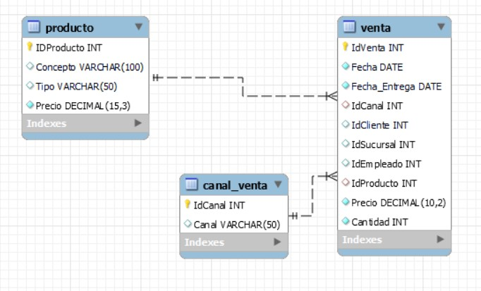

# Checkpoint - Módulo 2

Cómo responder:  
* Cuando se pida una respuesta numérica, redondear al segundo decimal.  
   Ejemplo: 1.3421 -> 1.34; 
            1.8888 -> 1.89; 
            3 -> 3.00. 

## Responder Verdadero ó Falso

## 1) Todos las métricas son KPI's

## 2) Un KPI es un indicador clave de rendimiento que ayuda a evaluar el valor actual el grado de cumplimiento de objetivo definido basándose en métricas.

## Elegir la opción correcta

## 3) Para el Sector de Instalaciones de una empresa de Televisión por Cable, cual de estos indicadores puede representar un KPI? 
   1- Gasto de publicidad en internet sobre ganancia adquirida para evaluar la efectividad de las campañas de marketing 
   2- Cantidad de usuarios por central para evaluar la instalación de nuevas centrales 
   3- Demora promedio en los tiempos de atención al cliente por el canal telefónico 

## 4) El espacio muestral es:
   1- El conjunto de todos los resultados posibles de un experimento. 
   2- Una tabla con las distintas funciones de probabilidad. 
   3- Un evento que puede describirse con una característica única. 

## 5) Dos sucesos son compatibles:
   1- Cuando pueden ocurrir al mismo tiempo. 
   2- Cuando son mutuamente excluyentes. 
   3- Cuando corresponden a un conjunto de eventos colectivamente exhaustivo. 

## Resuelve los siguientes ejercicios:

## En tu motor de base de datos MySQL, ejecutá las instrucciones del script 'Checkpoint_Create_Insert.sql' (Si no trabajas con MySQL es posible que tengas que realizar algunos ajustes en el script. También están provistas las tablas en formato csv dentro de la carpeta 'tablas_cp').
Se crearan 3 tablas: 
* venta:
* canal_venta
* producto 

Una empresa de venta de productos tiene como objetivo hacer crecer su canal de ventas OnLine, por tal motivo la dirección se plantean algunas cuestiones para entender como va evolucionando el negocio

## Contestar las siguientes preguntas, utilizando el DER y mysql:
## 6) ¿Cuál es el canal id del Producto cuyo nombre es EPSON COPYFAX 2000? 

## 7) ¿Cuál es el canal de ventas con menor cantidad de ventas registradas?
#### Pista: acordate de las funciones de agregacion AVG/SUM/MIN/MAX/COUNT 
   1- OnLine 
   2- Telefónica 
   3- Presencial 

## 8) Cual fue el mes con mayor venta de la sucursal 13 para el año 2015 ?
#### Pista para agrupar por mes podes usar el   DATE_FORMAT( date,'%Y%m') --> YYYYMM o  DATE_FORMAT( date,'%m') --> MM  
   1- 9 
   2- 3 
   3- 12 
   4- 2 
   5- 8 

## 9) Se define el tiempo de entrega como el tiempo en días transcurrido entre que se realiza la compra y se efectua la entrega. Par analizar mejoras en el servicio, la dirección desea saber: cuál es el año con el promedio más alto de este tiempo de entrega. (Fecha = Fecha de venta; Fecha_Entrega = Fecha de entrega)
#### Pista: acordate de las funciones de agregacion AVG/SUM/MIN/MAX

## 10) La dirección desea saber que tipo de producto tiene la mayor venta en 2020 (Tabla 'producto', campo Tipo = Tipo de producto)
#### Pista: acordate de las funciones de agregacion AVG/SUM/MIN/MAX
   1- INFORMATICA 
   2- ESTUCHERIA 
   3- AUDIO 
   4- IMPRESIÓN 
   5- GABINETES 
   6- GRABACION 
   7- BASES 
   8- GAMING 

## 11) ¿Cuál es el año y mes con la mayor cantidad de productos vendidos?
#### Informar la respuesta con 4 digitos para el año y 2 para el mes
#### Por ejemplo 201506 seria Junio 2015
#### Pista para agrupar por mes podes usar el   DATE_FORMAT( date,'%Y%m') --> YYYYMM o  DATE_FORMAT( date,'%m') --> MM 

## 12) ¿Cuantos productos tienen la palabra DVD en alguna parte de su nombre/concepto? 

## 13) ¿Cual de estos tipos de producto, tiene la menor diferencia de precio entre sus minimos y maximos?
   1- GABINETES	  
   2- GAMING	  
   3- IMPRESIÓN	 

## 14) Teniendo en cuenta que Fecha es la fecha real de compra, y Fecha_Entrega es la fecha real que se entrego el producto. ¿Cuantas ventas NO se entregaron el mismo mes en que fueron compradas?
#### Ejemplo
| Venta |Fecha      | Fecha_Entrega |  |
|-------|-----------|-------------- |-----|
|  1    |2018-03-09 | 2018-03-25 | --> Se entrego el mismo mes que fue hecha la venta |
|  2    |2020-06-29 | 2020-07-01 | --> No se entrego el mismo mes que la venta |

## 15) Cual es el Id del empleado que mayor cantidad de productos vendio en toda la historia de las ventas?

   1- 3603 
   2- 3504 
   3- 1675 
   4- 3186 

## 16) Si se colocan 5 canicas blancas y 5 canicas negras dentro de un frasco y luego, de manera aleatoria se quitan 2 seguidas ¿Cuál es la probabilidad de que ambas sean blancas?

## 17) Si se colocan 5 canicas blancas y 5 canicas negras dentro de un frasco y luego, de manera aleatoria se quitan 2 seguidas ¿Cuál es la probabilidad de que ambas sean de un mismo color?

## 18) Considerando un juego que consiste en acertar a la suma de la tirada de 2 dados, ¿cuál sería el valor de la suma más probable?

## 19) En una tramo de una autopista, pasan en promedio 2 camiones cada 5 minutos. ¿Cuál es la probabilidad de que en esos 5 minutos pasen más de 2 camiones?

## 20) En una ciudad, la probabilidad de lluvia cualquier día, es de 0.2, ¿cuál es la probabilidad de que en esa ciudad, llueva durante 2 días seguidos?
