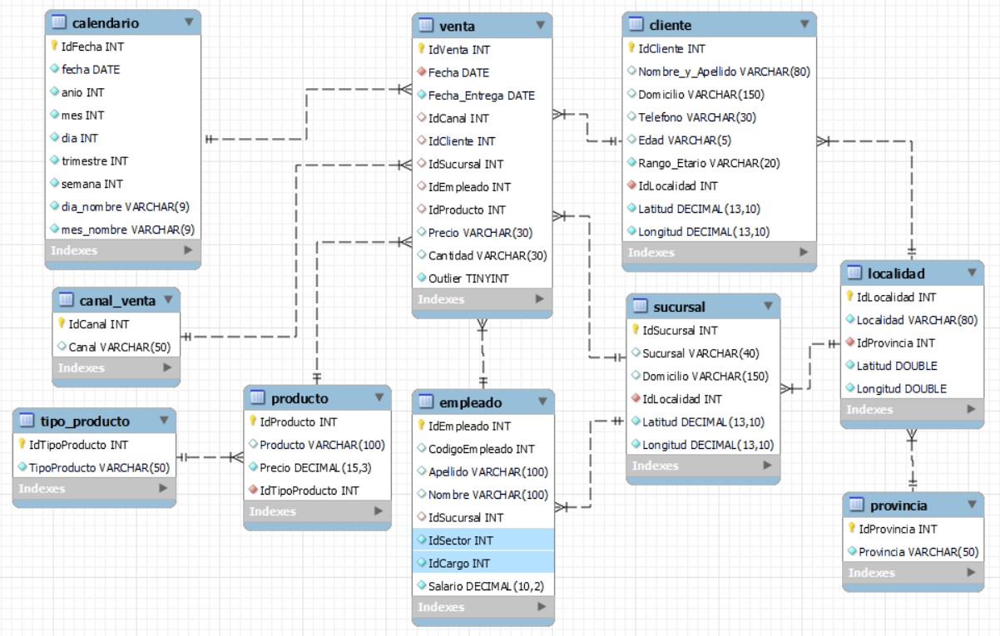

# Checkpoint - Módulo 3

Cómo responder:  
* Cuando se pida una respuesta numérica, redondear al entero más cercano.  
   Ejemplo: 1.3421 -> 1  
            1.8888 -> 2  
* Expresar porcentajes con rango entre 0 y 100.  

## Responder Verdadero ó Falso

### 1) Las tablas de hechos registran las operaciones ocurridas, todo tipo de transacciones donde intervienen las diferentes entidades del modelo.

### 2) La regla de las 3 sigmas para detección de Outliers está basada en la Media y la Desviación Estándar.

### 3) La asignación de índices para las tablas en SQL no genera nunguna mejora en la performance de los queries.

### 4) Dada la siguiente consulta SQL:
### SELECT Fecha, Count(*) FROM venta GROUP BY Fecha;
### Si se pretende filtrar las fechas que contienen más de 10 ventas, es necesario usar la sentencia WHERE

### 5) Los valores outliers se deben en todos los casos a cargas erróneas de los datos.

## Elegir la opción correcta en base a la observación del siguiente DER:

### 6) ¿Cuál de las siguientes no es una tabla que representa una dimensión?
   1- cliente 
   2- calendario 
   3- venta 
   4- provincia 

### 7) El DER presentado...
   1- Es un Modelo Estrella, porque tiene una sóla tabla de hechos. 
   2- Es un Modelo Estrella, ya que contiene referencias circulares. 
   3- No es un Modelo Estrella, ya que contiene referencias circulares. 

## Resuelve los siguientes ejercicios:

### En tu motor de base de datos MySQL, ejecutá las instrucciones del script 'Checkpoint_Create_Insert.sql' (Si no trabajas con MySQL es posible que tengas que realizar algunos ajustes en el script. También están provistas las tablas en formato csv dentro de la carpeta 'tablas_cp').

### 8) La ganancia neta por sucursal es las ventas menos los gastos (Ganancia = Venta - Gasto) ¿Cuál es la sucursal con mayor ganancia neta en 2020? 
#### Elige la opción correcta:
   1- Quilmes 
   2- Flores 
   3- Alberdi 

### 9) La ganancia neta por producto es las ventas menos las compras (Ganancia = Venta - Compra) ¿Cuál es el tipo de producto con mayor ganancia neta en 2020?
#### Elige la opción correcta:
   1- Informatica 
   2- Gaming 
   3- Grabacion 

### 10) Del total de clientes que realizaron compras en 2019 ¿Qué porcentaje lo hizo sólo en una única sucursal?

### 11) Del total de clientes que realizaron compras en 2020 ¿Qué porcentaje no había realizado compras en 2019?

### 12) ¿Qué cantidad de clientes realizó compras sólo por el canal presencial entre 2019 y 2020?

### 13) Utilizando el método 3 sigmas ¿Cuántos outliers existen en la variable monto de la venta por producto (Cantidad * Ventas) de la tabla venta? 
#### Responder con el número de outliers:

### 14) El negocio suele requerir con gran frecuencia consultas a nivel trimestral tanto sobre las ventas, como las compras y los gastos...
#### Elige la opción correcta:
   1- Con los índices creados existentes, sólo sobre las claves primarias y foráneas, sería suficiente para cubrir cualquier necesidad de consulta. 
   2- Sería aduecuado colocar un índice sobre el campo trimestre de la tabla calendario aunque este no sea una clave foránea. 
   3- No se puede crear índices sobre campos que no son clave. 

### Pablo es un estudiante de la carrera de Data Science en Henry, por lo que le interesa saber un poco más sobre las remuneraciones del área. Para esto, cuenta con un script de carga SQL llamado "Checkpoint_Create_Insert_salaries_SE.sql" donde posee sólo datos para "experiencia=SE' pero además, un csv llamado "ds_salaries_SIN_SE.csv" donde contiene el resto de los registros con otros valores para el campo "experiencia", con lo que decide hacer un ETL, ejecutando el primer script para crear la tabla y cargar los datos, pero adicionando los datos del CSV. (Si no trabajas con MySQL es posible que tengas que realizar algunos ajustes en el script. También están provistas las tablas en formato csv dentro de la carpeta 'tablas_cp'). 
Responder las preguntas:

### 15) ¿Cuál es el promedio de salarios en usd de los Data Scientist de la muestra en 2020?

### Pablo no puede saber con qué país está tratando, por lo que recurre al archivo countries.txt para averiguarlo. Luego de hacer la ingesta en MySQL (recuerden que no es comma separated values, piensen cúal puede ser el separador viendo el archivo), Tener en cuenta idPais(tabla salarios)=idResidencia(tabla countries) y responda:

### 16) ¿Qué país pagó los salarios en moneda local más altos en 2022 para cargos de experiencia media (MI)?
#### Elige la opción correcta:

1. Chile  
2. India  
3. Polonia (Poland). 

### 17) Si consideramos el tipo de cambio como el salario en moneda local dividio el salario en USD, ¿cuál es el mayor valor de esta variable en la muestra la muestra?

### 18) ¿ Cuántos países NO tienen información sobre los salarios de sus Data Scientists? 

## Compartir con los alumnos:
* La carpeta "tablas_cp"
* Los scripts Checkpoint_Create_Insert.sql y Checkpoint_Create_Insert_SE.sql
* Los archivos "countries.txt" y "ds_salaries_SIN_SE.csv"